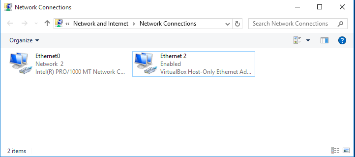
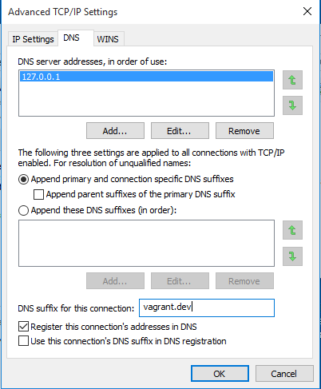

# Landrush: DNS for Vagrant 

Simple DNS that's visible on both the guest and the host.

Spins up a small DNS server and redirects DNS traffic from your VMs to use it,
automatically registers/deregisters IP addresses of guests as they come up
and down.

<!-- MarkdownTOC -->

- [Installation](#installation)
- [Usage](#usage)
    - [Get started](#get-started)
    - [Dynamic entries](#dynamic-entries)
    - [Static entries](#static-entries)
    - [Wildcard Subdomains](#wildcard-subdomains)
    - [Unmatched Queries](#unmatched-queries)
    - [Visibility on the Guest](#visibility-on-the-guest)
    - [Visibility on the Host](#visibility-on-the-host)
        - [OS X](#os-x)
        - [Linux](#linux)
        - [Windows](#windows)
        - [Other Devices (phone)](#other-devices-phone)
    - [Additional CLI commands](#additional-cli-commands)
- [Development](#development)
    - [Help Out!](#help-out)

<!-- /MarkdownTOC -->

## Installation

Install under Vagrant (1.1 or later):

    $ vagrant plugin install landrush

## Usage

### Get started

Enable the plugin in your `Vagrantfile`:

    config.landrush.enabled = true

Bring up a machine.

    $ vagrant up

And you should be able to get your hostname from your host:

    $ dig -p 10053 @localhost myhost.vagrant.test

If you shut down your guest, the entries associated with it will be removed.

Landrush assigns your vm's hostname from either the vagrant config (see the `examples/Vagrantfile`) or system's actual hostname by running the `hostname` command. A default of "guest-vm" is assumed if hostname is otherwise not available.

### Dynamic entries

Every time a VM is started, its IP address is automatically detected and a DNS record is created that maps the hostname to its IP.

If for any reason the auto-detection detects no IP address or the wrong IP address, or you want to override it, you can do like so:

    config.landrush.host_ip_address = '1.2.3.4'

If you are using a multi-machine `Vagrantfile`, configure this inside each of your `config.vm.define` sections.

### Static entries

You can add static host entries to the DNS server in your `Vagrantfile` like so:

    config.landrush.host 'myhost.example.com', '1.2.3.4'

This is great for overriding production services for nodes you might be testing locally. For example, perhaps you might want to override the hostname of your puppetmaster to point to a local vagrant box instead.

### Wildcard Subdomains

For your convenience, any subdomain of a DNS entry known to landrush will resolve to the same IP address as the entry. For example: given `myhost.vagrant.test -> 1.2.3.4`, both `foo.myhost.vagrant.test` and `bar.myhost.vagrant.test` will also resolve to `1.2.3.4`.

If you would like to configure your guests to be accessible from the host as subdomains of something other than the default `vagrant.test`, you can use the `config.landrush.tld` option in your Vagrantfile like so:

    config.landrush.tld = 'vm'

Note that from the __host__, you will only be able to access subdomains of your configured TLD by default- so wildcard subdomains only apply to that space. For the __guest__, wildcard subdomains work for anything.

### Unmatched Queries

Any DNS queries that do not match will be passed through to an upstream DNS server, so this will be able to serve as the one-stop shop for your guests' DNS needs.

If you would like to configure your own upstream servers, add upstream entries to your `Vagrantfile` like so:

    config.landrush.upstream '10.1.1.10'
    # Set the port to 1001
    config.landrush.upstream '10.1.2.10', 1001
    # If your upstream is TCP only for some strange reason
    config.landrush.upstream '10.1.3.10', 1001, :tcp

### Visibility on the Guest

Linux guests should automatically have their DNS traffic redirected via `iptables` rules to the Landrush DNS server. File an issue if this does not work for you.

To disable this functionality:

    config.landrush.guest_redirect_dns = false

You may want to do this if you are already proxying all your DNS requests through your host (e.g. using VirtualBox's natdnshostresolver1 option) and you
have DNS servers that you can easily set as upstreams in the daemon (e.g. DNS requests that go through the host's VPN connection).

### Visibility on the Host

#### OS X

If you're on an OS X host, we use a nice trick to unobtrusively add a secondary DNS server only for specific domains.
Landrush adds a file into `/etc/resolver` that points lookups for hostnames ending in your `config.landrush.tld` domain
name to its DNS server. (Check out `man 5 resolver` on your Mac OS X host for more information on this file's syntax.)

#### Linux

Though it's not automatically set up by landrush, similar behavior can be achieved on Linux hosts with `dnsmasq`. You
can integrate Landrush with dnsmasq on Ubuntu like so (tested on Ubuntu 13.10):

    sudo apt-get install -y resolvconf dnsmasq
    sudo sh -c 'echo "server=/vagrant.test/127.0.0.1#10053" > /etc/dnsmasq.d/vagrant-landrush'
    sudo service dnsmasq restart

If you use a TLD other than the default `vagrant.test`, replace the TLD in the above instructions accordingly. Please be aware that anything ending in '.local' as TLD will not work because the `avahi` daemon reserves this TLD for its own uses.

#### Windows

On Windows a secondary DNS server can be configured via the properties of a
network adapter. This will be illustrated in the following using Windows 10 with
VirtualBox.

When running VirtualBox on Windows in combination with Landrush the Network
Connections (`Control Panel\Network and Internet\Network Connections`) looks
somewhat like this after a successful `vagrant up`:

There will be at least one VirtualBox network adapter. There might be multiple
depending on your configuration (number of networks configured) and how many VMs
you have running, but you just need to modify one.

In a first step you need to identify the VirtualBox network adapter used for the
private network of your VM. Landrush requires a private network adapter to work
and will create one in case you are not explicitly configuring one in your
`Vagrantfile`.

To quickly view the settings of each network adapter you can run the following
command in a shell:

    netsh interface ip show config

The output should look something like that:

    Configuration for interface "Ethernet0"
        DHCP enabled:                         Yes
        IP Address:                           172.16.74.143
        Subnet Prefix:                        172.16.74.0/24 (mask 255.255.255.0)
        Default Gateway:                      172.16.74.2
        Gateway Metric:                       0
        InterfaceMetric:                      10
        DNS servers configured through DHCP:  172.16.74.2
        Register with which suffix:           Primary only
        WINS servers configured through DHCP: 172.16.74.2

    Configuration for interface "VirtualBox Host-Only Network"
        DHCP enabled:                         No
        IP Address:                           10.1.2.1
        Subnet Prefix:                        10.1.2.0/24 (mask 255.255.255.0)
        InterfaceMetric:                      10
        Statically Configured DNS Servers:    None
        Register with which suffix:           Primary only
        Statically Configured WINS Servers:   None

In our case we are interested in the `VirtualBox Host-Only Network` which
has in this example the private network IP 10.1.2.1. If you don't have a static
private network IP configured and you cannot determine the right adapter via
the `netsh` output, ssh into the VM (`vagrant ssh`) and run `ifconfig` to view
the network configuration of the VM.

Once you identified the right network adapter run the following as Administrator
(using the network adapter name of the adapter with the determined private
network IP):

     netsh interface ipv4 add dnsserver "VirtualBox Host-Only Network" address=127.0.0.1 index=1

This should be enough for Windows 10. On other Windows versions, you might have to
also add your TLD to the DNS suffix list on the DNS Advanced TCP/IP Settings tab:

#### Other Devices (phone)

You might want to resolve Landrush's DNS-entries on *additional* computing devices, like a mobile phone.

Please refer to [/doc/proxy-mobile](/doc/proxy-mobile) for instructions.

### Additional CLI commands

Check out `vagrant landrush` for additional commands to monitor the DNS server daemon.

## Development

Install dependencies:

    bundle install
    
Build the gem:

    bundle exec rake install
    
Delete build artifacts:

    bundle exec rake clobber

Run the test suite:

    bundle exec rake test
    
Run single test file:

    bundle exec rake test  TEST=<path-to-test>

Run the vagrant binary with the landrush plugin loaded from your local source code:

    bundle exec vagrant landrush <command>

### Help Out!

This project could use your feedback and help! Please don't hesitate to open issues or submit pull requests. NO HESITATION IS ALLOWED. NONE WHATSOEVER.  See [CONTRIBUTING.md](CONTIRBUTING.md) for more details.

